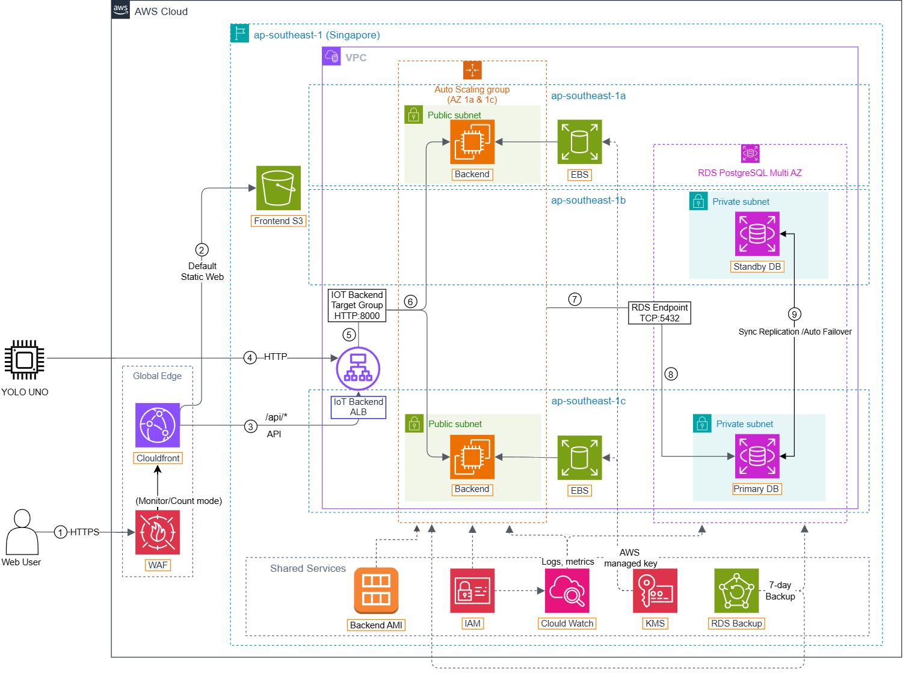

# AWS IoT Monitoring and Control Dashboard 🚀

🌐 **Language / Ngôn ngữ:** [English](README.md) | [Tiếng Việt](README.vi.md)

An AWS-based system for remote environmental monitoring and IoT device control, built with FastAPI, React, PostgreSQL, YOLO UNO, and AWS services.

> The current scope is a prototype for a single room, `room_01`. It is not a multi-branch Building Management System (BMS) or an enterprise-scale operational platform.

---

## 📋 Project Overview

YOLO UNO collects temperature, humidity, and light readings, then sends telemetry over HTTP directly to the Application Load Balancer (ALB). The ALB forwards requests to a target group backed by two FastAPI instances in an Auto Scaling Group (ASG). The backend stores telemetry and command states in a Multi-AZ Amazon RDS for PostgreSQL instance.

The React + Vite dashboard is built and stored in a private Amazon S3 bucket, served through Amazon CloudFront with Origin Access Control (OAC), and protected by AWS WAF in Count/Monitor mode. Browser requests to `/api/*` are routed by CloudFront to the ALB. The device polls for pending commands, executes each command once, and sends an ACK so the backend can change its state from `Pending` to `Executed`. Amazon CloudWatch collects backend logs, monitors ALB, ASG, EC2, and RDS metrics, and evaluates eight configured alarms.

- **Report author:** Phạm Lê Minh Khôi
- **Institution:** Ho Chi Minh City University of Technology (HCMUT) – Faculty of Computer Science and Engineering
- **Workshop:** [View the online report](https://toniminhkhoi.github.io/aws-fcaj-report/)

---

## 🏛️ System Architecture

<p align="center">
  
</p>

### Main Components

1. **Amazon CloudFront, AWS WAF, and private S3:** Serve the React + Vite dashboard over HTTPS. The default behavior reads private S3 content through OAC, while `/api/*` forwards dynamic requests to the ALB. Three AWS managed WAF rule groups currently run in Count/Monitor mode.
2. **Application Load Balancer, Target Group, and Auto Scaling Group:** Distribute HTTP requests to two healthy FastAPI targets across `ap-southeast-1a` and `ap-southeast-1c`. The ASG uses min/desired/max capacity `2/2/4`.
3. **Amazon EC2 and encrypted EBS:** Run FastAPI/Uvicorn on port `8000` as a `systemd` service. The launch template uses a private AMI and encrypted 10 GiB gp3 root volumes with the AWS-managed `aws/ebs` KMS key.
4. **Amazon RDS for PostgreSQL Multi-AZ:** Stores devices, telemetry history, and command lifecycle data. The primary is in `ap-southeast-1c`; the synchronous standby is in `ap-southeast-1b` and is not a read replica.
5. **YOLO UNO / Python Simulator:** Sends telemetry, retrieves pending commands, and returns acknowledgements through the ALB DNS name over HTTP. The simulator supports testing when physical hardware is unavailable.
6. **Amazon CloudWatch:** Collects backend logs, monitors ALB, ASG, EC2, and RDS metrics, and evaluates eight alarms. Alarm actions/SNS notifications are not configured.
7. **Amazon VPC, Security Groups, and IAM Role:** Restrict ALB-to-backend traffic on port `8000`, backend-to-RDS traffic on port `5432`, administrative SSH, and CloudWatch Agent permissions.

The implemented AWS services are **Amazon S3, Amazon CloudFront, AWS WAF, Elastic Load Balancing, EC2 Auto Scaling, Amazon EC2, Amazon EBS, Amazon RDS for PostgreSQL Multi-AZ, Amazon VPC, Security Groups, AWS IAM, Amazon CloudWatch, and CloudWatch Alarms**.

AWS IoT Core, Lambda, API Gateway, DynamoDB, Amazon SQS, Secrets Manager, and Amazon SNS are not implemented in the current version.

---

## 🔄 Main Workflows

- **Browser telemetry:** Browser → HTTPS CloudFront/WAF → `/api/*` behavior → ALB → healthy FastAPI target → RDS PostgreSQL → response through the same path.
- **Device telemetry:** YOLO UNO → HTTP ALB DNS → target group → FastAPI → RDS PostgreSQL.
- **Device command:** An operator uses the dashboard → FastAPI creates a command in the `Pending` state → the device polls through the ALB and executes it → the device sends an ACK → the backend changes the state to `Executed`.
- **Monitoring:** CloudWatch Agent sends backend logs and EC2 operating-system metrics; CloudWatch also monitors ALB, ASG, EC2, and RDS metrics through an operations dashboard and eight alarms.

---

## 👥 Team Members and Responsibilities

| Team member | Responsibilities |
| :--- | :--- |
| **Phạm Lê Minh Khôi** | AWS architecture; VPC, Security Groups, IAM Role, EC2, RDS, and CloudWatch; DevOps; YOLO UNO hardware; sensors, actuators, telemetry, command polling, and ACK mechanism |
| **Ngô Minh Thuận** | FastAPI backend; API endpoints, Pydantic schemas, SQLAlchemy models, PostgreSQL integration, telemetry processing, command lifecycle, and ACK handling |
| **Thượng Đình Hưng** | React + Vite frontend; dashboard UI, telemetry visualization, control features, system integration, error handling, and demonstration video production |
| **Lê Bảo Khánh** | Proposal, blog posts, weekly worklogs, event report, bilingual Workshop, navigation, visual evidence, and documentation quality assurance |

Detailed contributions and individual reflections are provided in [section 5.11](content/5-Workshop/5.11-Results-Challenges-Future/_index.md) and [section 5.12](content/5-Workshop/5.12-Project-Handover/_index.md).

---

## 🧰 Technology Stack

- **Backend:** Python, FastAPI, Uvicorn, SQLAlchemy, and Pydantic.
- **Frontend:** React, Vite, TypeScript, and Tailwind CSS.
- **Database:** PostgreSQL on Amazon RDS.
- **Hardware:** YOLO UNO/ESP32-S3, PlatformIO, DHT20, analog light sensor, LCD1602, fan, light/relay, and servo.
- **AWS:** S3, CloudFront, WAF, ALB, Target Groups, EC2 Auto Scaling, EC2, encrypted EBS, RDS PostgreSQL Multi-AZ, VPC, Security Groups, IAM Role, CloudWatch, and CloudWatch Alarms.
- **Report:** Hugo and `hugo-theme-learn`.

---

## 📚 Report Contents

- `content/1-Worklog/`: Weekly worklogs.
- `content/2-Proposal/`: Project proposal.
- `content/3-BlogsTranslated/`: Translated blog posts.
- `content/4-EventParticipated/`: Participated events.
- `content/5-Workshop/`: Bilingual AWS IoT Dashboard Workshop.
- `content/6-Self-evaluation/`: Self-evaluation.
- `content/7-Feedback/`: Feedback.
- `content/8-References/`: Source code, demo video, project documents, and official technical references.

The backend, frontend, and firmware source code are maintained in the `aws-iot-dashboard` application repository. This repository contains the internship report and Workshop.

---

## ▶️ Run the Website with Hugo

```powershell
hugo server
```

Then open `http://localhost:1313/`. Use the language selector to switch between **English** and **Tiếng Việt**.

To generate a static build:

```powershell
hugo --minify
```

---

## 🔐 Security Notes

- Do not commit `.env`, `.pem`, private keys, passwords, or `hardware/include/secrets.h`.
- Keep the frontend S3 bucket private and allow reads only through CloudFront OAC.
- Use HTTPS for viewers. The CloudFront-to-ALB origin and YOLO UNO-to-ALB paths currently use HTTP and are documented limitations.
- Allow backend port `8000` only from the ALB Security Group.
- Allow PostgreSQL connections to RDS only from the EC2 Security Group.
- Restrict SSH access to the administrator's IP address.
- Do not hard-code AWS access keys in source code.
- Use an IAM Role for CloudWatch Agent permissions.
- Keep EBS encryption enabled for all ASG instances.
- Treat WAF Count/Monitor mode as observation only; requests are not blocked until rules are deliberately changed to Block mode.

---

## 8. 📚 References

The complete reference collection is available in [section 8 - References](content/8-References/_index.md):

- **Source code:** [AWS IoT Monitoring and Control Dashboard](https://github.com/toniminhkhoi/aws-iot-dashboard) and the [source-code handover notes](content/8-References/8.1-source-code/_index.md).
- **Demonstration:** [End-to-end demo video](https://drive.google.com/file/d/1T97dUY58hbT2ppxvg7ESR12Jg9BA828W/view?usp=sharing) and its [coverage description](content/8-References/8.2-demo-video/_index.md).
- **Project documents:** Backend, frontend, firmware, architecture, Workshop, and clean-up guides listed in [section 8.3](content/8-References/8.3-project-documents/_index.md).
- **Official documentation:** AWS services, FastAPI, React, Vite, PostgreSQL, PlatformIO, and YOLO UNO references collected in [section 8.4](content/8-References/8.4-related-links/_index.md).

---

## 📄 Copyright

Copyright © 2026 Phạm Lê Minh Khôi – HCMUT. All rights reserved.
